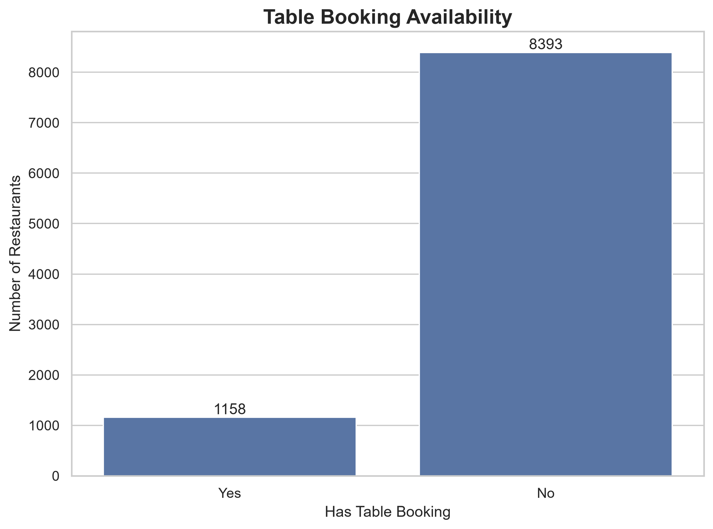
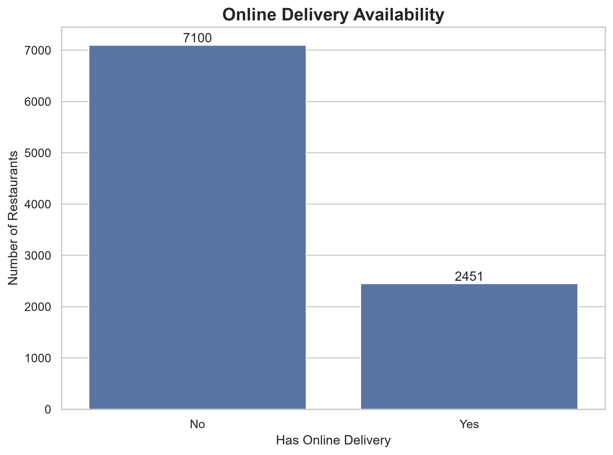
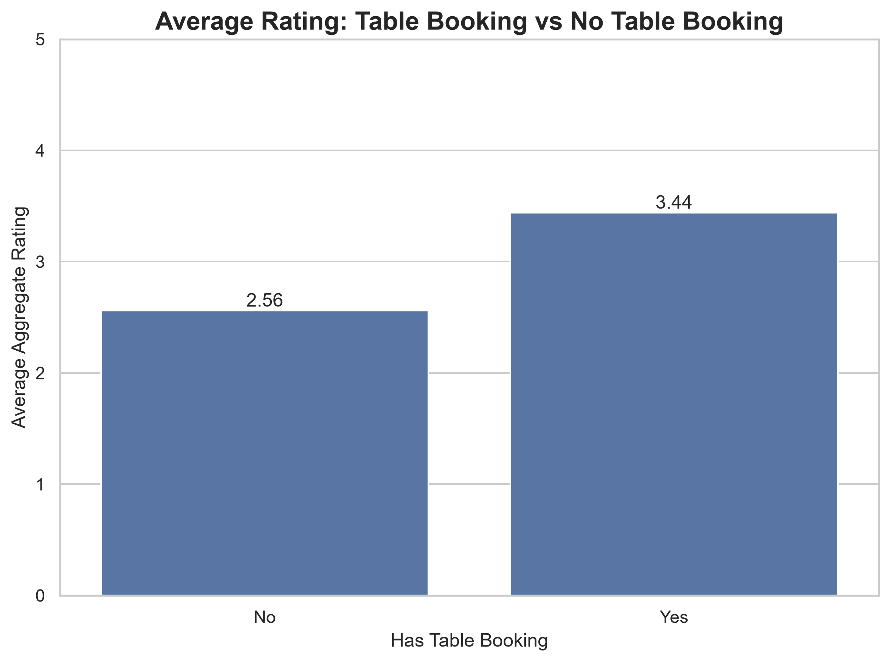
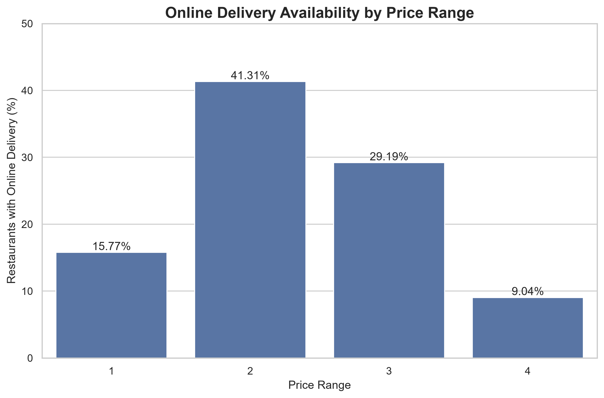

# Cognifyz Technologies – Level 2 Task 1
## Table Booking and Online Delivery Analysis


---

## 📌 Project Overview

This project is part of the **Cognifyz Technologies Data Science Internship – Level 2, Task 1**.

The objective is to analyze restaurant data to understand:

- The availability of table booking.
- The availability of online delivery.
- The relationship between table booking and restaurant ratings.
- Online delivery availability across different price ranges.

The analysis was performed using **Python, Pandas, Matplotlib, and Seaborn**.

The provided restaurant dataset is used as the sole source of data.

---

## 🎯 Objectives

This project focuses on the following requirements:

1. Determine the percentage of restaurants that offer **table booking** and **online delivery**.
2. Compare the **average aggregate ratings** of restaurants with and without table booking.
3. Analyze **online delivery availability across different price ranges**.

---

## 📂 Project Structure

```text
Cognifyz_Level2_Task1/
│
├── Data/
│   └── Dataset (2).csv
│
├── Analysis/
│   └── level2_task1.py
│
├── Visualizations/
│   ├── 01_table_booking_availability.png
│   ├── 02_online_delivery_availability.png
│   ├── 03_average_rating_table_booking.png
│   └── 04_online_delivery_by_price_range.png
│
├── Insights/
│   └── insights.md
│
├── README.md
└── LICENSE
```

---

## 🛠️ Technologies Used

- **Python 3.13**
- **Pandas** – Data manipulation and analysis
- **Matplotlib** – Data visualization
- **Seaborn** – Statistical visualization
- **Pathlib** – File and directory management

---

## 📊 Dataset

The dataset contains restaurant information including:

- Restaurant ID
- Restaurant Name
- Country Code
- City
- Address
- Locality
- Cuisines
- Average Cost for Two
- Currency
- Table Booking
- Online Delivery
- Price Range
- Aggregate Rating
- Rating Color
- Rating Text
- Votes
- Latitude
- Longitude

### Dataset Size

- **Rows:** 9,551
- **Columns:** 21

---

# 📈 Analysis and Results

## 1. Table Booking Availability

The analysis shows:

| Table Booking | Restaurants | Percentage |
|---|---:|---:|
| Yes | 1,158 | 12.12% |
| No | 8,393 | 87.88% |

Only **12.12%** of restaurants offer table booking, while **87.88%** do not.

### Visualization



---

## 2. Online Delivery Availability

The analysis shows:

| Online Delivery | Restaurants | Percentage |
|---|---:|---:|
| Yes | 2,451 | 25.66% |
| No | 7,100 | 74.34% |

Online delivery is available at **25.66%** of restaurants, while **74.34%** do not offer online delivery.

### Visualization



---

## 3. Average Rating and Table Booking

The average aggregate rating was compared between restaurants with and without table booking.

| Table Booking | Average Rating |
|---|---:|
| Yes | 3.44 |
| No | 2.56 |

Restaurants offering table booking have an observed average rating **0.88 points higher** than restaurants without table booking.

### Visualization



> **Note:** This is an observed relationship in the dataset and does not establish that table booking causes higher ratings.

---

## 4. Online Delivery by Price Range

Online delivery availability was analyzed across the four price ranges.

| Price Range | Online Delivery | No Online Delivery |
|---:|---:|---:|
| 1 | 15.77% | 84.23% |
| 2 | **41.31%** | 58.69% |
| 3 | 29.19% | 70.81% |
| 4 | 9.04% | 90.96% |

### Key Finding

**Price Range 2** has the highest online delivery availability at **41.31%**.

**Price Range 4** has the lowest online delivery availability at **9.04%**.

### Visualization



---

# 🔎 Key Insights

### Table Booking

- Most restaurants do not offer table booking.
- Only **12.12%** of restaurants provide table booking.

### Online Delivery

- Online delivery is more common than table booking.
- **25.66%** of restaurants offer online delivery.

### Ratings

- Restaurants with table booking have an average rating of **3.44**.
- Restaurants without table booking have an average rating of **2.56**.
- The observed difference is **0.88 points**.

### Price Range

- **Price Range 2** has the highest online delivery availability.
- **Price Range 4** has the lowest online delivery availability.

---

# 💡 Business Interpretation

The analysis indicates that online delivery has greater adoption than table booking within the dataset.

Restaurants offering table booking show a higher average aggregate rating than restaurants without table booking. However, this represents an observed association and does not establish a causal relationship.

Online delivery availability varies across price ranges, with **Price Range 2** showing the highest proportion of restaurants offering online delivery.

---

# ▶️ How to Run the Project

## 1. Clone the repository

```bash
git clone https://github.com/Vedanshu-Fegade/Cognifyz-Level2-Task1.git
```

## 2. Navigate to the project

```bash
cd Cognifyz-Level2-Task1
```

## 3. Install dependencies

```bash
pip install pandas matplotlib seaborn
```

## 4. Run the analysis

```bash
python Analysis/level2_task1.py
```

The analysis results will be displayed in the terminal.

The generated visualizations will be saved automatically in:

```text
Visualizations/
```

---

# 📁 Output Files

The project generates four high-resolution visualizations:

1. `01_table_booking_availability.png`
2. `02_online_delivery_availability.png`
3. `03_average_rating_table_booking.png`
4. `04_online_delivery_by_price_range.png`

---

# 🧠 Skills Demonstrated

- Data loading and inspection
- Data manipulation with Pandas
- Percentage calculations
- GroupBy analysis
- Cross-tabulation
- Descriptive analysis
- Data visualization
- Business interpretation
- File and directory handling
- Reproducible Python analysis
- Git and GitHub

---

# 🏁 Conclusion

This project successfully analyzes table booking and online delivery patterns across restaurants.

The analysis found that:

- **12.12%** of restaurants offer table booking.
- **25.66%** offer online delivery.
- Restaurants with table booking have an average rating of **3.44**, compared with **2.56** for restaurants without table booking.
- **Price Range 2** has the highest online delivery availability at **41.31%**.
- **Price Range 4** has the lowest online delivery availability at **9.04%**.

The project fulfills the analytical objectives of **Cognifyz Technologies – Level 2 Task 1**.

---

## 👨‍💻 Author

**Vedanshu Fegade**

Data Science Intern  
Cognifyz Technologies

---

## 🏢 Internship

**Cognifyz Technologies – Data Science Internship**

**Level 2 – Task 1: Table Booking and Online Delivery**